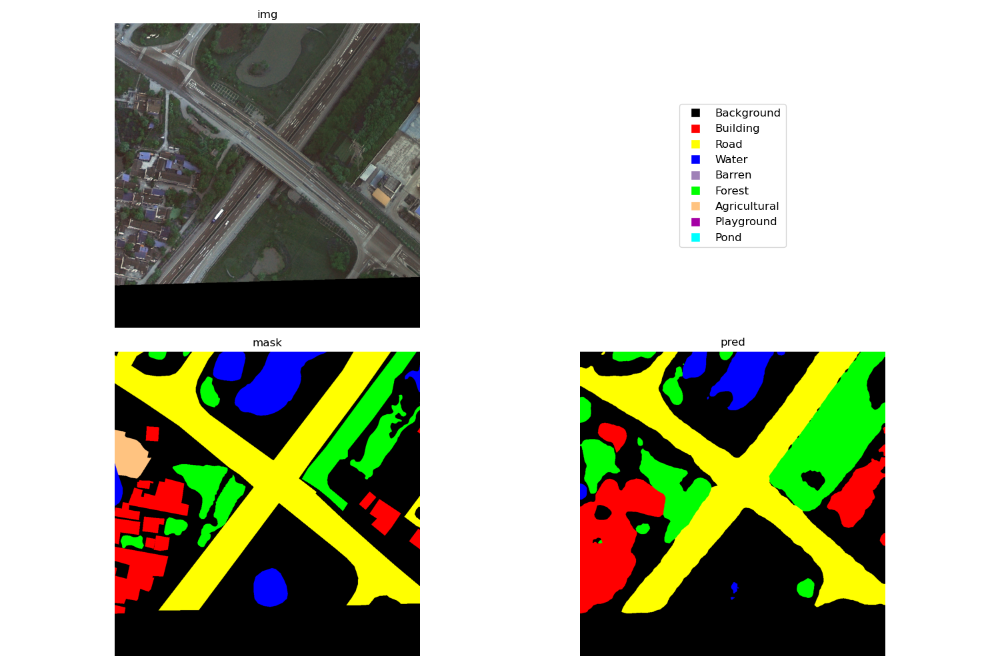

# 语义分割
以 [EarthVQA](https://github.com/Junjue-Wang/EarthVQA) 为例的一个简单语义分割示例。数据集可以从 [kaggle](https://www.kaggle.com/datasets/dyiyacao/earthvqa) 下载。

## file structure
```
{ROOT}/
├── datasets/EarthVQA/
│   ├── Train/
│   │   ├── images_png/
│   │   └── masks_png/
│   ├── Val/
│   |   ├── images_png/
│   |   └── masks_png/
│   └── Test/
│       └── images_png/
├── scripts
│   ├── build_EarthVQA.py   # 用于下载和预处理 EarthVQA 数据集的脚本
|   ├── test_compile.py     # 测试 torch.compile 对模型推理速度的影响
|   └── test_smp.py         # 测试 segmentation_models_pytorch 中各种模型能否被 torch.compile 成功编译运行
│── train_eomt.py           # 基于 lightly_train 的训练脚本
└── train_smp.py            # 基于 segmentation_models_pytorch 的训练脚本
```

## prediction example
```python
python train_eomt.py 3 --ids 1
```
