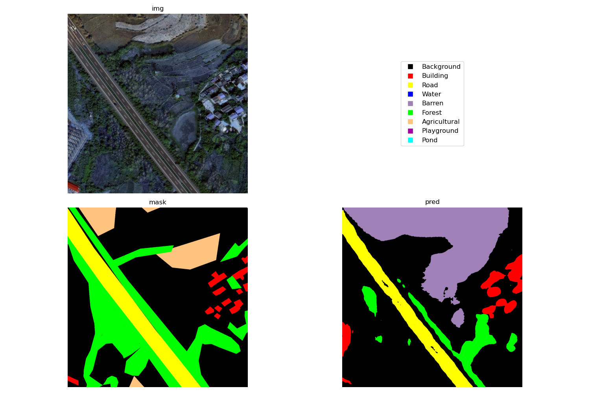
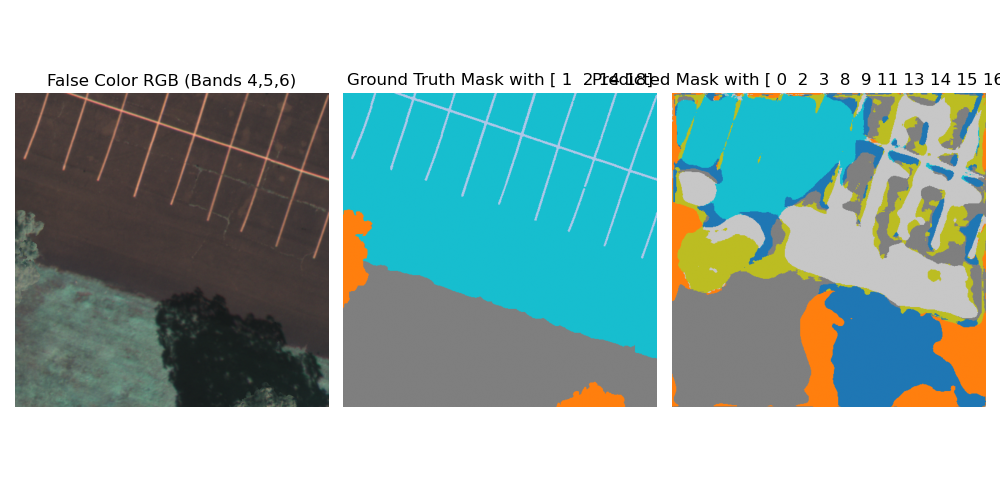
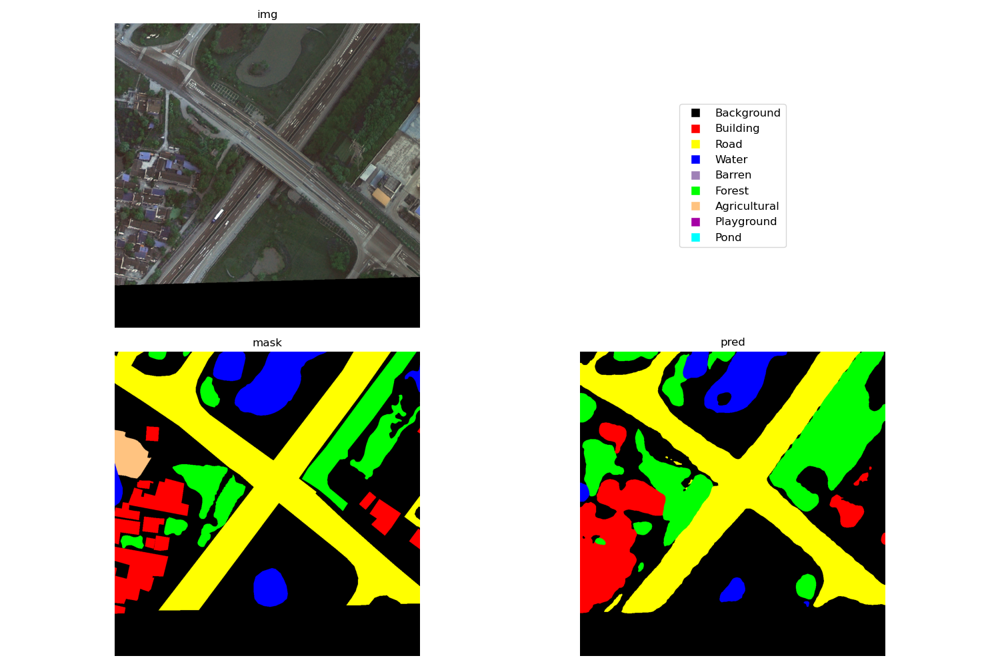
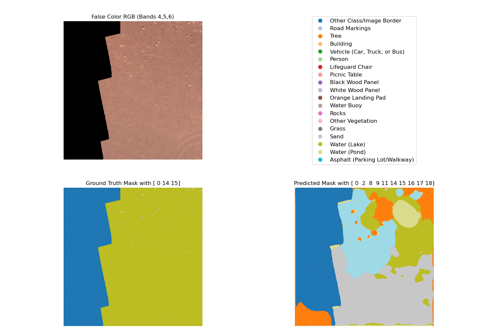

# 语义分割
支持数据集:
- [EarthVQA](https://github.com/Junjue-Wang/EarthVQA)
- [EarthVL](https://github.com/Junjue-Wang/EarthVL)
- [RIT-18](https://github.com/rmkemker/RIT-18/)

支持模型:
- [segmentation_models.pytorch](https://github.com/qubvel-org/segmentation_models.pytorch/)
- [EoMT](https://github.com/lightly-ai/lightly-train)

## file structure
```
{ROOT}/
├── datasets
|   ├── EarthVQA/     # EarthVQA 数据集目录结构，EarthVL 目录结构相同
│   |   ├── Train/
│   |   |   ├── images_png/
│   |   |   └── masks_png/
│   |   ├── Val/
│   |   |   ├── images_png/
│   |   |   └── masks_png/
│   |   └── Test/
│   |       └── images_png/
|   └── rit18/        # RIT-18 数据集目录结构
|       ├── train/
|       |   ├── images/
|       |   └── labels/
|       └── val/
|           ├── images/
|           └── labels/
├── scripts
│   ├── build_EarthVQA.py   # 用于下载和预处理 EarthVQA 数据集的脚本
|   ├── build_EarthVL.py    # 用于下载预处理 EarthVL 数据集的脚本(下载脚本已被注释)
|   ├── build_RIT18.py      # 用于预处理 RIT-18 数据集的脚本，需要手动下载数据集
|   ├── test_compile.py     # 测试 torch.compile 对模型推理速度的影响
|   └── test_smp.py         # 测试 segmentation_models_pytorch 中各种模型能否被 torch.compile 成功编译运行
│── train_eomt.py           # 基于 lightly_train 的训练脚本(支持 EarthVQA 和 EarthVL)
│── train_smp.py            # 基于 segmentation_models_pytorch 的训练脚本(支持 EarthVQA 和 EarthVL)
└── train_geo.py            # 基于 torchgeo 的训练脚本(支持 RIT-18) TODO: 暂无 tansoform 
```

## prediction example
| EarthVQA | RIT-18 |
|---|---|
|  |  |
|  |  |